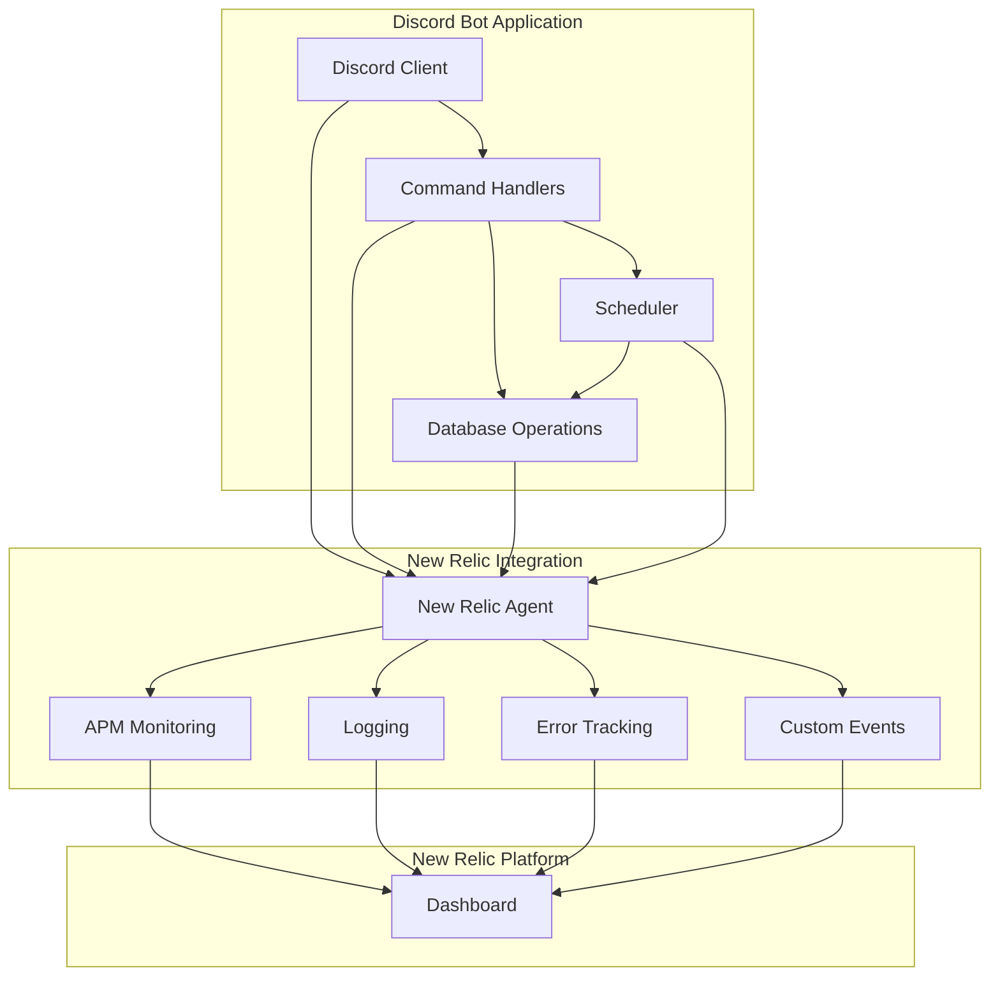

# New Relic Integration Plan for Maqraah Bot

## Overview

Integrate New Relic for comprehensive logging, monitoring, and error tracking for the Discord bot. This will provide visibility into bot operations, command executions, database operations, and especially note-related activities.

## Architecture Diagram

## Implementation Steps

### 1. Install New Relic Dependencies

- Install `newrelic` package
- Install `@types/newrelic` for TypeScript support

### 2. Create New Relic Configuration

- Create `newrelic.js` configuration file
- Configure application name, license key, and logging settings
- Set up custom attributes for Discord-specific metadata

### 3. Create Centralized Logger Module

- Create `src/logger.ts` with New Relic integration
- Implement structured logging with different log levels
- Add custom attributes for Discord context (user ID, guild ID, channel ID, command name)

### 4. Update Main Entry Point

- Import New Relic at the top of `src/index.ts`
- Add startup/shutdown logging
- Log bot initialization events

### 5. Add Logging to Command Handlers

Update all command files to include comprehensive logging:

- **configuration.ts**: Log configuration changes, validation errors, voice channel updates
- **notes.ts**: Log all note operations (create, show, delete) with user context
- **progress.ts**: Log progress updates
- **help.ts**: Log help command usage
- **test.ts**: Log test command executions

### 6. Add Logging to Database Operations

- Update `src/database.ts` to log database initialization
- Update repository files to log CRUD operations
- Log query execution times and errors

### 7. Add Logging to Scheduler

- Update `src/scheduler.ts` to log:
  - Job scheduling events
  - Job execution start/end
  - Reminder sending events
  - Note deletion during reminders
  - Cron job errors

### 8. Add Error Handling and Logging

- Wrap all async operations in try-catch blocks
- Log errors with full stack traces and context
- Use New Relic's `noticeError()` for error tracking
- Add custom error attributes

### 9. Add Custom Events for Notes

- Create custom New Relic events for note operations:
  - `NoteCreated`: When a user creates a note
  - `NoteViewed`: When notes are viewed
  - `NoteDeleted`: When notes are deleted
  - `NotesIncludedInReminder`: When notes are sent in daily reminder

### 10. Update Environment Configuration

- Add New Relic environment variables to `.env.example`:
  - `NEW_RELIC_APP_NAME`: Application name
  - `NEW_RELIC_LICENSE_KEY`: New Relic license key
  - `NEW_RELIC_LOG_LEVEL`: Logging level (info, debug, etc.)

### 11. Add Performance Monitoring

- Track command execution times
- Monitor database query performance
- Track Discord API response times
- Monitor scheduler job execution duration

### 12. Create Custom Dashboard Queries (Documentation)

- Document recommended NRQL queries for:
  - Command usage statistics
  - Note creation trends
  - Error rates by command
  - Bot uptime and health
  - Reminder delivery success rate

## File Changes Summary

### New Files to Create

1. `newrelic.js` - New Relic agent configuration
2. `src/logger.ts` - Centralized logging module with New Relic integration

### Files to Modify

1. `package.json` - Add New Relic dependencies
2. `.env.example` - Add New Relic environment variables
3. `src/index.ts` - Import New Relic, add startup/shutdown logging
4. `src/database.ts` - Add database operation logging
5. `src/scheduler.ts` - Add scheduler event logging
6. `src/commands/configuration.ts` - Add configuration change logging
7. `src/commands/notes.ts` - Add note operation logging with custom events
8. `src/commands/progress.ts` - Add progress update logging
9. `src/commands/help.ts` - Add help command logging
10. `src/commands/test.ts` - Add test command logging
11. `src/repositories/ConfigurationRepository.ts` - Add repository logging
12. `src/repositories/NotesRepository.ts` - Add repository logging
13. `src/repositories/ProgressRepository.ts` - Add repository logging

## Logging Strategy

### Log Levels

- **ERROR**: Critical errors, failed operations, exceptions
- **WARN**: Non-critical issues, deprecated usage, validation failures
- **INFO**: Important events (bot start, command execution, reminders sent)
- **DEBUG**: Detailed information for troubleshooting

### Custom Attributes to Include

- `discord.userId`: User ID who triggered the action
- `discord.guildId`: Guild/server ID
- `discord.channelId`: Channel ID
- `discord.commandName`: Name of the command executed
- `discord.subcommand`: Subcommand name if applicable
- `operation.type`: Type of operation (create, read, update, delete)
- `operation.status`: Success or failure
- `operation.duration`: Operation duration in milliseconds

### Note-Specific Logging

For note operations, we'll log:

- User ID who created/viewed/deleted notes
- Note content (truncated if too long)
- Number of notes affected
- Timestamp of operation
- Whether notes were included in daily reminder

## Error Handling Strategy

1. **Global Error Handler**: Catch unhandled errors and log to New Relic
2. **Command-Level Error Handling**: Wrap each command execution in try-catch
3. **Database Error Handling**: Log database connection and query errors
4. **Discord API Error Handling**: Log Discord API failures with context
5. **Scheduler Error Handling**: Log cron job failures and retry attempts

## Benefits of This Integration

1. **Comprehensive Visibility**: See all bot operations in one place
2. **Error Tracking**: Get notified immediately when errors occur
3. **Performance Monitoring**: Identify slow operations and bottlenecks
4. **Note Analytics**: Track note creation, viewing, and deletion patterns
5. **Command Usage**: Understand which commands are used most frequently
6. **Troubleshooting**: Quickly diagnose issues with detailed logs and context
7. **Alerting**: Set up alerts for critical errors or unusual patterns
